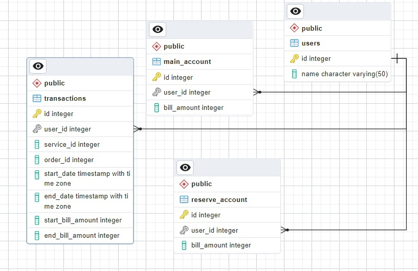

# billing-api
# __[Тестовое задание на позицию стажера-бекендера](https://github.com/avito-tech/internship_backend_2022)__

# __Микросервис для работы с балансом пользователей__

### Используемые технологии:
* Язык разработки - __Go__
* Реляционная СУБД - __PostgreSQL__

### Основная функциональность по работе с счетом
* __GET /users/:user_id/account__ - получение баланса пользователя с id, равным :user_id <br>

Пример ответа сервера:
```json
{
    "balance": "1000.00"
}
```

* __POST /users/:user_id/account/deposit__ - пополнение счета пользователя с id, равным :user_id <br>

Пример тела запроса:
```json
{
    "amount": 10000,
}
```

Пример ответа сервера:
```json
{
    "message": "10000.00 were successfully deposited into user account"
}
```

* __POST /users/:user_id/account/withdraw__ - снятие с счета пользователя с id, равным :user_id <br>

Пример тела запроса:
```json
{
    "amount": 5000
}
```

Пример ответа сервера:
```json
{
    "message": "5000.00 were successfully withdrawn from user account"
}
```

* __POST /users/:user_id/account/transfer__ - перевод между пользователями (отправитель - пользователь с :user_id, получатель - в теле запроса) <br>

Пример тела запроса:
```json
{
    "to_user_id": 2,
    "amount": 2000,
}
```

Пример ответа сервера:
```json
{
    "message": "2000.00 were successfully transferred"
}
```

* __POST /transactions/reserve__ - резервирование денег с основного счета<br>

Пример тела запроса:
```json
{
    "user_id": 1,
    "service_id": 1,
    "order_id": 1,
    "amount": 500
}
```

Пример ответа сервера:
```json
{
    "message": "500.00 were successfully reserved from user"
}
```

* __POST /transactions/complete__ - признание выручки <br>

Пример тела запроса:
```json
{
    "user_id": 1,
    "service_id": 1,
    "order_id": 1,
    "amount": 500
}
```

Пример ответа сервера:
```json
{
    "message": "500.00 were successfully withdrawn from user"
}
```
---

### Дополнительные задания:
1) Реализовать метод для получения месячного отчета. На вход: год-месяц. На выходе ссылка на CSV файл. <br>
Пример запроса: __GET /month_report?year=2022&month=10__ 

Пример скачанного файла:
```csv
ServiceID,Amount
0,0
1,50000
```

---

### Дополнительная функциональность для работы с пользователями:
* __POST /users/auth/sign-up__ - регистрация нового пользователя.<br>

Пример тела запроса:
```json
{
    "name": "user0",
}
```
Пример ответа сервера:
```json
{
    "id": 1
}
```
* __GET /users__ - просмотр всех существующих пользователей в системе. <br>

Пример ответа сервера:
```json
[   
    {
        "id": 1,
        "name": "user0"
    },
    {
        "id": 2,
        "name": "user1"
    }
]
``` 

---

### Примечания к проекту:
* Архитектура REST API
* Фреймворк [gin-gonic/gin](https://github.com/gin-gonic/gin)
* Чистая архитектура (handler -> service -> repository)
* Для работы с БД используется пакет [sqlx](https://github.com/jmoiron/sqlx)
* Docker, Docker-compose, Makefile 
* Конфигурация приложения с помощью пакета [viper]("https://github.com/spf13/viper"). Работа с переменными окружения.
* Graceful Shutdown
* В БД и внутри структур языка Go баланс хранится в целых числах
* Приложение запускается на порту 8080
* Тестирование проводилось через Postman

### Схема БД: <br>
__user <-> main_account - one-to-one <br>__
__user <-> reserve_account - one-to-one <br>__
__user <-> transactions - one-to-many <br>__


---

### Для запуска приложения используется docker-compose
```


